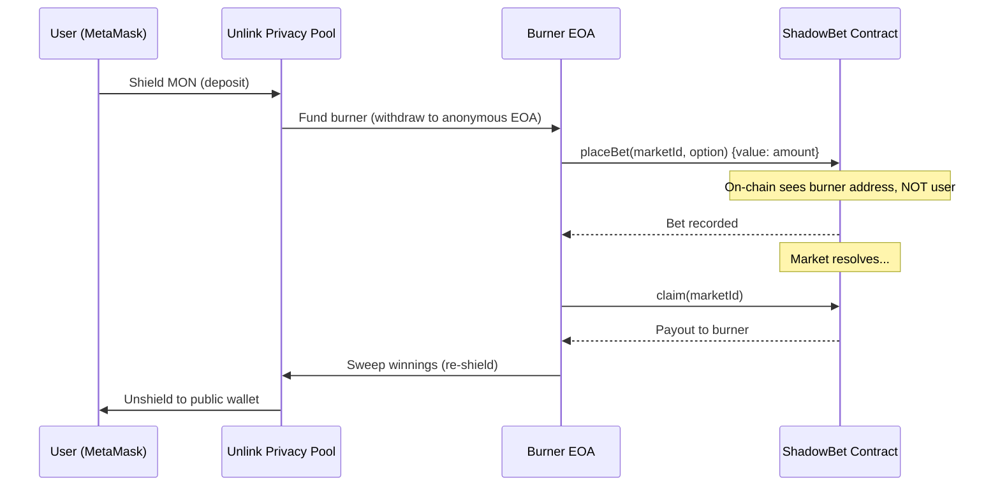

# ShadowBet

**Private prediction markets on Monad, powered by Unlink.**

> Your bets. Your secret. On-chain.

## The Problem

Every prediction market today is **fully transparent**. The moment you place a bet, everyone can see:

- **What** you bet on (YES or NO)
- **How much** you bet
- **Who** you are (your wallet address)

This creates real problems:

1. **Copycat trading** — whales get front-run by bots copying their positions
2. **Social pressure** — people bet with the crowd instead of their conviction
3. **Information leakage** — your position reveals your private knowledge

## The Solution

ShadowBet uses [Unlink](https://unlink.xyz) to make prediction market bets **completely private**.

**How it works:**

```
You (Public Wallet)
  │
  ▼ Shield MON
  ┌──────────────────┐
  │  Unlink Privacy  │
  │     Pool         │
  └────────┬─────────┘
           │ Fund Burner
           ▼
  ┌──────────────────┐
  │  Anonymous       │  ← unlinkable to your identity
  │  Burner EOA      │
  └────────┬─────────┘
           │ placeBet()
           ▼
  ┌──────────────────┐
  │  ShadowBet       │  On-chain: sees burner address, not you
  │  Contract        │
  └──────────────────┘
```

**What's private:**
- Your identity (bets come from anonymous burner addresses)
- Your position (YES/NO choice never emitted in events)
- Your bet amount (shielded through the privacy pool)

**What's on-chain:**
- The market exists and is active
- A bet was placed (from an unlinkable address)
- The total pool sizes

## Tech Stack

| Layer | Technology |
|-------|------------|
| Chain | [Monad Testnet](https://docs.monad.xyz) (400ms blocks, 800ms finality) |
| Privacy | [Unlink SDK](https://docs.unlink.xyz) (ZK-proof privacy pool + burner accounts) |
| Contract | Solidity 0.8.24 (Parimutuel prediction market) |
| Frontend | React 19 + TypeScript + Vite |
| Wallet | MetaMask + Unlink Private Account |

## Architecture



## User Flow

1. **Connect** — MetaMask on Monad Testnet
2. **Create Private Wallet** — One-click Unlink account setup
3. **Shield** — Deposit MON into the privacy pool
4. **Bet** — Place a private bet via anonymous burner address
5. **Claim** — Collect winnings, automatically re-shielded
6. **Unshield** — Withdraw to your public wallet when ready

## Smart Contract

**Address:** [`0x1187167eFA940EA400A8C2c7D91573A2Ec93145A`](https://testnet.monadexplorer.com/address/0x1187167eFA940EA400A8C2c7D91573A2Ec93145A)

| Function | Description |
|----------|-------------|
| `createMarket(question, endTime)` | Create a YES/NO prediction market |
| `placeBet(marketId, option)` | Bet MON on YES (0) or NO (1) |
| `resolve(marketId, winner)` | Resolve market with winning option |
| `claim(marketId)` | Claim parimutuel payout |

**Privacy feature:** The `BetPlaced` event intentionally omits the `option` field. Combined with burner addresses, neither your identity nor your position is revealed.

## Development

```bash
# Frontend
cd frontend
npm install
npm run dev     # http://localhost:5173

# Contract (Foundry)
cd contracts
forge build
forge test
```

## Hackathon

Built at [Unlink x Monad Hackathon](https://dorahacks.io) (Feb 27 – Mar 1, 2026, NYC).

**Tracks:** DeFi, Best Use of Unlink SDK

---

*ShadowBet — because your conviction shouldn't be public.*
