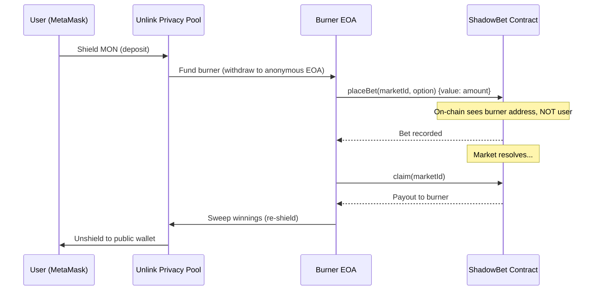

# ShadowBet


**Private prediction markets on Monad, powered by Unlink.**

> Your bets. Your secret. On-chain.

**[Live Demo](https://shadow-bet.vercel.app)** | [Smart Contract](https://testnet.monadexplorer.com/address/0x1187167eFA940EA400A8C2c7D91573A2Ec93145A)

## The Problem

Every prediction market today is **fully transparent**. The moment you place a bet, everyone can see:

- **What** you bet on (YES or NO)
- **How much** you bet
- **Who** you are (your wallet address)

This creates real problems:

1. **Copycat trading** — whales get front-run by bots copying their positions
2. **Social pressure** — people bet with the crowd instead of their conviction
3. **Information leakage** — your position reveals your private knowledge

## The Solution

ShadowBet uses [Unlink](https://unlink.xyz) to make prediction market bets **completely private**.

**How it works:**

```
You (Public Wallet)
  │
  ▼ Shield MON
  ┌──────────────────┐
  │  Unlink Privacy  │
  │     Pool         │
  └────────┬─────────┘
           │ Fund Burner
           ▼
  ┌──────────────────┐
  │  Anonymous       │  ← unlinkable to your identity
  │  Burner EOA      │
  └────────┬─────────┘
           │ placeBet()
           ▼
  ┌──────────────────┐
  │  ShadowBet       │  On-chain: sees burner address, not you
  │  Contract        │
  └──────────────────┘
```

**What's private:**
- Your identity (bets come from anonymous burner addresses)
- Your position (YES/NO choice never emitted in events)
- Your bet amount (shielded through the privacy pool)

**What's on-chain:**
- The market exists and is active
- A bet was placed (from an unlinkable address)
- The total pool sizes

## Who Benefits

- **Bettors** — No more copycat trading or social pressure. Your conviction stays private, your edge stays yours.
- **Market Creators** — Privacy attracts larger, more honest bets. Whales participate when their positions aren't exposed.
- **Unlink & Monad Ecosystem** — First privacy-native DeFi application, proving that ZK privacy primitives have real product-market fit beyond simple transfers.

## Tech Stack

| Layer | Technology |
|-------|------------|
| Chain | [Monad Testnet](https://docs.monad.xyz) (400ms blocks, 800ms finality) |
| Privacy | [Unlink SDK](https://docs.unlink.xyz) (ZK-proof privacy pool + burner accounts) |
| Contract | Solidity 0.8.24 — standard EVM, no Monad-specific precompiles needed |
| Frontend | React 19 + TypeScript + Vite |
| Wallet | MetaMask + Unlink Private Account |

## Architecture



## User Flow

1. **Connect** — MetaMask on Monad Testnet
2. **Create Private Wallet** — One-click Unlink account setup
3. **Shield** — Deposit MON into the privacy pool
4. **Bet** — Place a private bet via anonymous burner address
5. **Claim** — Collect winnings, automatically re-shielded
6. **Unshield** — Withdraw to your public wallet when ready

## Smart Contract

**Address:** [`0x1187167eFA940EA400A8C2c7D91573A2Ec93145A`](https://testnet.monadexplorer.com/address/0x1187167eFA940EA400A8C2c7D91573A2Ec93145A)

| Function | Description |
|----------|-------------|
| `createMarket(question, endTime)` | Create a YES/NO prediction market |
| `placeBet(marketId, option)` | Bet MON on YES (0) or NO (1) |
| `resolve(marketId, winner)` | Resolve market with winning option |
| `claim(marketId)` | Claim parimutuel payout |

**Privacy feature:** The `BetPlaced` event intentionally omits the `option` field. Combined with burner addresses, neither your identity nor your position is revealed.

## Privacy Model

ShadowBet provides **two layers of privacy** that work together:

### Layer 1: Identity Privacy (Unlink SDK)
Your public wallet never touches the betting contract. Instead:
- **Shield** deposits into a ZK-proof privacy pool (breaks the on-chain link)
- **Burner EOA** — a fresh, anonymous account funded from the pool
- The contract only sees the burner address, which cannot be traced back to you

### Layer 2: Position Privacy (Smart Contract)
Even if someone analyzes the burner address, they still can't determine your bet:
- `BetPlaced` event **intentionally omits** the `option` field (YES/NO)
- The bet direction is stored in contract storage but never emitted
- An observer sees *"address X bet Y MON on market Z"* but not *which side*

**Result:** Neither your identity nor your position is revealed on-chain.

## Tests

```
$ forge test -vvv

[PASS] testCreateMarket()          — market creation + state verification
[PASS] testPlaceBetYes()           — YES bet updates yesPool correctly
[PASS] testPlaceBetNo()            — NO bet updates noPool correctly
[PASS] testResolveAndClaim()       — winner receives full pool
[PASS] testFullLifecycle()         — end-to-end: create → bet → resolve → claim
[PASS] testPrivacy_EventOmitsOption() — BetPlaced event has no option field
[PASS] testRevert_NonAdminCreate() — only admin can create markets
[PASS] testRevert_BetExpiredMarket() — cannot bet after endTime
[PASS] testRevert_DoubleBet()      — one bet per address per market
[PASS] testRevert_ClaimBeforeResolved() — cannot claim unresolved market
[PASS] testRevert_LoserClaim()     — losing side cannot claim
[PASS] testRevert_ResolveBeforeEnd() — cannot resolve before endTime

Suite result: ok. 12 passed; 0 failed; 0 skipped
```

## Development

```bash
# Quick start
make install    # install all dependencies
make dev        # frontend dev server (http://localhost:5173)

# Contract
make test       # run Foundry tests
make deploy     # deploy to Monad testnet (set PRIVATE_KEY in .env)

# Frontend
make build      # production build
```

See [`.env.example`](.env.example) for required environment variables.

## Project Structure

```
shadow-bet/
├── contracts/
│   ├── src/ShadowBet.sol      # Core prediction market contract
│   ├── test/ShadowBet.t.sol   # 12 Foundry tests
│   └── foundry.toml
├── frontend/
│   ├── src/
│   │   ├── App.tsx            # Main app + routing + landing page
│   │   ├── BetWidget.tsx      # Full betting UI with Unlink integration
│   │   ├── MarketCard.tsx     # Market card component (grid layout)
│   │   ├── HowItWorks.tsx     # Privacy flow visualization
│   │   ├── PrivacyProof.tsx   # Visual diff: normal vs private betting
│   │   ├── contract.ts       # ABI, addresses, error mappings
│   │   └── App.css            # Dark theme, responsive design
│   └── public/logo.svg
├── scripts/create-markets.ts  # Demo market deployment script
├── Makefile                   # Build/test/deploy automation
├── .github/workflows/ci.yml  # CI: forge test + npm build
└── .env.example
```

## Screenshots

<!-- Add screenshots here -->

## Hackathon

Built at [Unlink x Monad Hackathon](https://dorahacks.io) (Feb 27 – Mar 1, 2026, NYC).

**Track:** DeFi

---

*ShadowBet — because your conviction shouldn't be public.*
